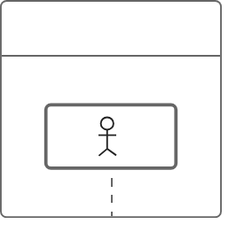

# Diagram Skill

Generate diagrams using **ZenUML** (sequence diagrams) or **Mermaid** (everything else), saved as markdown files. Optionally render to PNG via the ZenUML web renderer.

## DSL Selection

| Diagram Type | DSL | Why |
|---|---|---|
| Sequence diagram | **ZenUML** | Natural nesting for activation bars, cleaner return semantics |
| Flowchart, class, ER, state, other | **Mermaid** | Broad coverage, rich notation |

Respect the user's explicit DSL choice if they specify one.

## Workflow

1. **Understand** - What to diagram? From code, text, or data?
2. **If from code** - Glob to find files, Read to examine, Grep to trace relationships
3. **Choose DSL** per table above
4. **Read gotchas** - `references/zenuml-syntax.md` or `references/mermaid-syntax.md` in this skill directory
   - Improving or transforming an **existing SVG** diagram instead of generating one → read `references/diagram-rules.md` and follow its scope, execution split, and verification steps
5. **Generate DSL** and **write to `.md` file**
6. **Render image** (optional) - see "Image Rendering" section below
7. **Tell the user** the file path (and image path / renderer URL if rendered)

## Output Format

Write a `.md` file in the current working directory. Descriptive filename (e.g., `auth-flow.md`).

**CRITICAL**: Both ZenUML and Mermaid use the ` ```mermaid ` code fence. ZenUML adds `zenuml` as the first line inside the fence.

### ZenUML:

````markdown
# [Title]

[1-2 sentence description]


````

### Mermaid:

````markdown
# [Title]

[1-2 sentence description]

```mermaid
[Mermaid DSL]
```
````

## Image Rendering

For ZenUML diagrams, you can render to a PNG image using the **ZenUML web renderer**.

### Renderer URL

```
https://zenuml-web-renderer.zenuml.workers.dev/renderer?code={URL_ENCODED_ZENUML_DSL}
```

The DSL must be **URL-encoded** (e.g., spaces → `%20`, newlines → `%0A`). Use Bash with `python3 -c` or `node -e` to encode:

```bash
# Encode ZenUML DSL to URL
node -e "console.log(encodeURIComponent(require('fs').readFileSync('/dev/stdin','utf8')))" <<< 'A -> B.method() { return result }'
```

### Rendering with Playwright

When the user asks for an image/screenshot/PNG, or when visual verification is needed:

1. **Construct the URL** — URL-encode the ZenUML DSL and build the renderer URL
2. **Navigate** — Use `browser_navigate` to open the renderer URL
3. **Wait for render** — Use `browser_wait_for` or a short delay for the diagram to render
4. **Screenshot** — Use `browser_take_screenshot` to capture the diagram as PNG
5. **Save** — Save with a descriptive filename matching the `.md` file (e.g., `auth-flow.png`)

### When to render images

- **Always render** when the user says "render", "screenshot", "image", "PNG", or "show me"
- **Offer to render** after generating any ZenUML diagram — mention the renderer URL
- **Skip rendering** if the user only wants DSL/markdown output

## Key ZenUML Gotchas

These are the things LLMs get wrong — read `references/zenuml-syntax.md` for details:

- **Participant names with spaces MUST be quoted**: `"Auth Service"` not `Auth Service`
- **Async vs sync**: `A -> B: text` (async, no activation) vs `A -> B.method() { }` (sync, activation bar)
- **return vs @return**: `return` replies to caller, `@return C: text` sends to different participant
- **if conditions**: single word, quoted string, or expression — NOT `if (valid and approved)`
- **Message length**: under 20 chars, use comments for details

## Diagram Rules (SVG)

`references/diagram-rules.md` holds the reusable Diagram Rules for SVG diagrams: preserve every business node and relationship unless redesign is authorized; decision-node text capacity (diamond vs long-text hexagon); rectangular node corners, capsule exception, `labelBox` size tiers (S/M/L/XL); semantic background palette with 4.5:1 contrast pairs; script-first orthogonal routing (ports, tracks, `r=5` bends, arrow tip on target edge, one full path per relationship, crossing detection); AI limited to genre/semantic judgement; four-step verification. These rules target SVG; they do not govern ZenUML/Mermaid DSL generation above.

## Quality

- 15-20 nodes max per diagram
- Clear, concise labels
- Comments for non-obvious parts
- Follow codebase naming conventions
