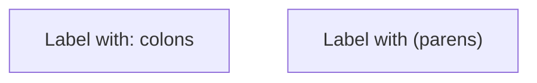
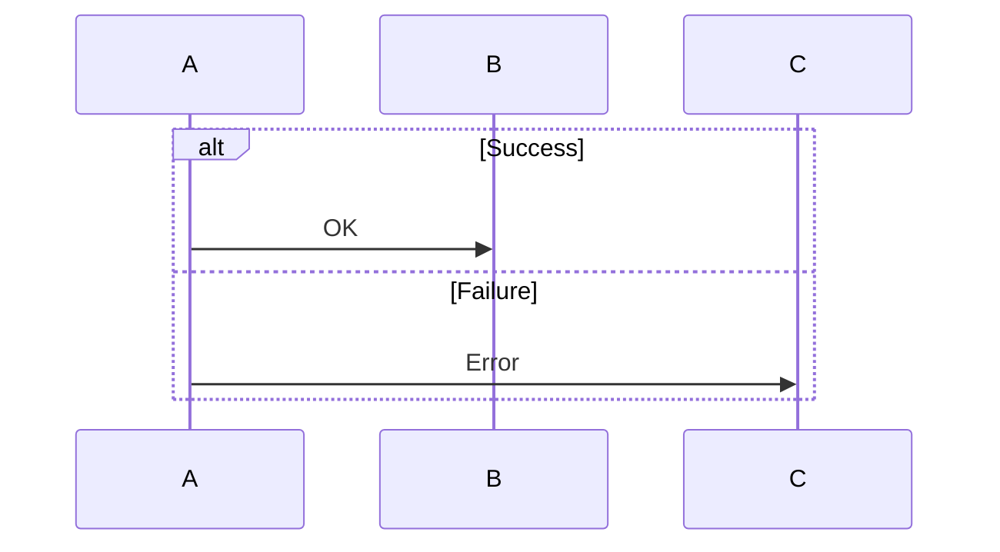
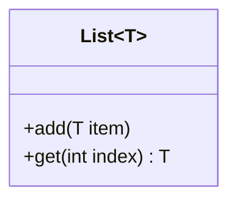
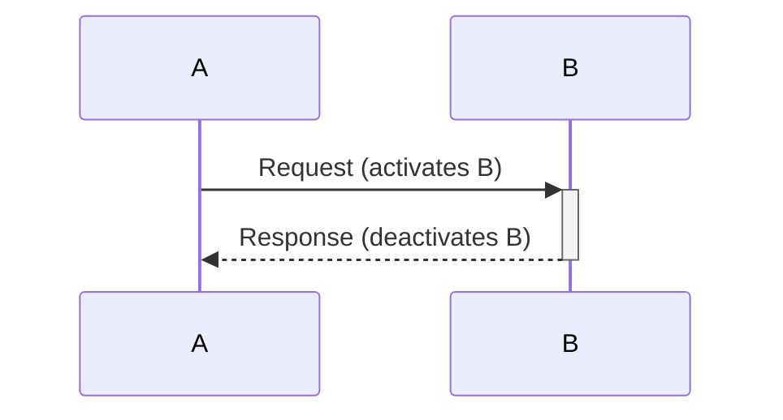
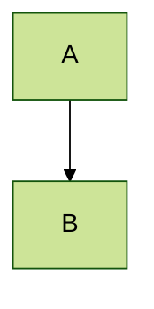

# Mermaid Gotchas

LLMs generally know Mermaid syntax well. This file covers only common mistakes and non-obvious behavior.

## Special Characters in Labels

Node IDs can't have spaces. Labels with special chars need quotes:



## Forgetting `end`

Every `alt`, `opt`, `loop`, `par`, `critical`, and `subgraph` block needs `end`:



## ER Diagram Cardinality

The symbols are non-obvious and easy to mix up:

```
||--||   Exactly one to exactly one
||--o{   One to zero-or-more
||--|{   One to one-or-more
}o--o{   Zero-or-more to zero-or-more
```

The `o` means "zero" (optional), `|` means "one" (required), `{` means "many".

## Class Diagram Generic Types

Use `~T~` not `<T>` — angle brackets break the parser:



## Flowchart Direction

`TD` and `TB` are identical (top-down). `LR` works better for sequential/timeline flows.

## Sequence Diagram Activation Shorthand

`+` and `-` on arrows control activation bars:



## Theme Configuration

Goes BEFORE the diagram type declaration:


