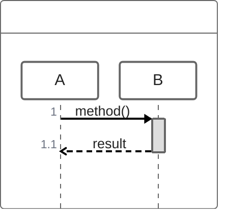

# ZenUML Gotchas

LLMs generally know ZenUML syntax. This file covers only the tricky parts that cause errors.

## Code Fence (CRITICAL)

ZenUML uses the `mermaid` fence with a `zenuml` directive — NOT a `zenuml` fence:

````markdown

````

## Participant Names with Spaces

MUST use double quotes. This is the #1 source of parse errors:

```
// WRONG - breaks the parser
Client -> Auth Service.validate()

// RIGHT
Client -> "Auth Service".validate()
```

## Async vs Sync — the Distinction Matters

```
// Async: colon separator, no activation bar
A -> B: fire and forget

// Sync: dot + method, creates activation bar with nesting
A -> B.process() {
  return result
}
```

## Sync Messages with Spaces in Description

```
// Single word — no quotes needed
A -> B.process()

// Multiple words — MUST quote
A -> B."validate request"()
```

## return vs @return

```
A -> B.process() {
  return result       // replies to A (the caller)
  @return C: notify   // sends to C (different participant)
}
```

`return` without a target always replies to the immediate caller. Use `@return` only for messages to a different participant.

## if Condition Rules

```
// RIGHT
if (valid)
if ("user is admin")
if (count > 0)

// WRONG - multi-word without quotes
if (valid and approved)
```

## Message Length

Keep under 20 chars. Use a comment for context:

```
// HTML response with embedded ZenUML content
User -> Page: HTML with DSL
```

## Participants and Aliases

Declare participants with `name as "Label"` (name first, label second):

```
// RIGHT — name first, label second
API as "Confluence API"
Save as saveToPlatform

// WRONG — label first, name second
"Confluence API" as API
saveToPlatform as Save
```

The `@` prefix adds an icon, not a participant declaration:

```
// RIGHT — plain participant (no icon)
API as "Confluence API"

// RIGHT — participant with Actor icon
@Actor User

// WRONG — @Participant is not valid syntax
@Participant "Confluence API" as API
```

## Coloring

Color comment goes on the line BEFORE the message:

```
// (red) Critical path
A -> B.process()
```
